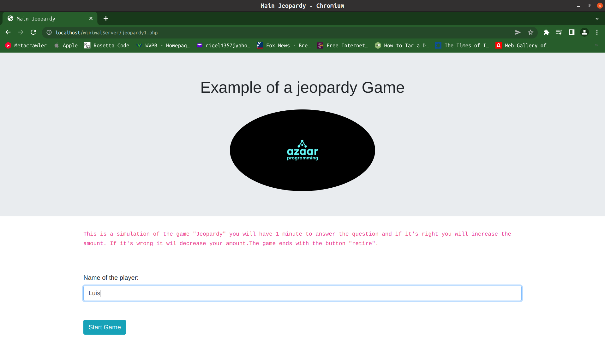
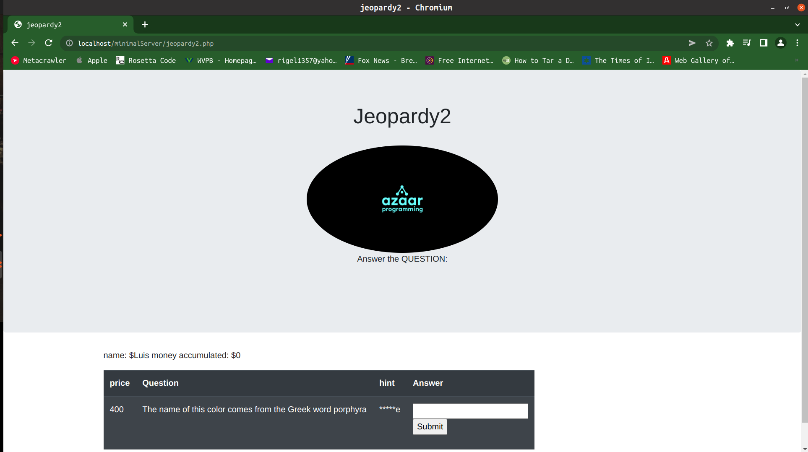

#Jeopardy Game

## Getting Started





###linux install

1. first update your debian distro as example Ubuntu:

```bash
sudo apt-get update
```

2. and then install the LAMP stack (the "^" is necessary):

```bash
sudo apt-get install lamp-server^
```

3. After this copy all the folder to the "/var/www/html/" path.

4. Set up the file "conector8.php" with the credentials of your database.The default set up is:
$servername = "localhost";
$username = "root";
$password = "your_password_here";
$dbname = "cdMexico";

5. Import all the data with the command:

```bash
sudo mysql -u username -p database_name < Dump20220609.sql
```
6. Finally type the following URL in a web browser:

http://localhost/{project_folder}/jeopardy1.php

7. error log file is located in
```bash
/var/log/apache2/error.log
```
###Windows install


1. Install a wamp server from your trusted sites,(I recommend https://www.apachefriends.org/).

2. After this copy all the folder to the path:

```basic
\xampp\htdocs
```
3. Set up the file "conector8.php" with the credentials of your database.The default set up is:
$servername = "localhost";
$username = "root";
$password = "your_password_here";
$dbname = "cdMexico";

4. Import all the data with the command:

```bash
sudo mysql -u username -p database_name < Dump20220607.sql
```
5. Finally type in the following URL in a web browser:

http://localhost/{project_folder}/jeopardy1.php

6. error log file is located in

```bash
/var/log/apache2/error.log
```

## Contributing

We encourage you to contribute to Jeopardy Game! Soon will be a web page
to all the petitions and changes, but for now please send to:

```bash
robertoazaar@gmail.com
```


## License

Jeopardy1 is released under the [MIT License](https://opensource.org/licenses/MIT).
